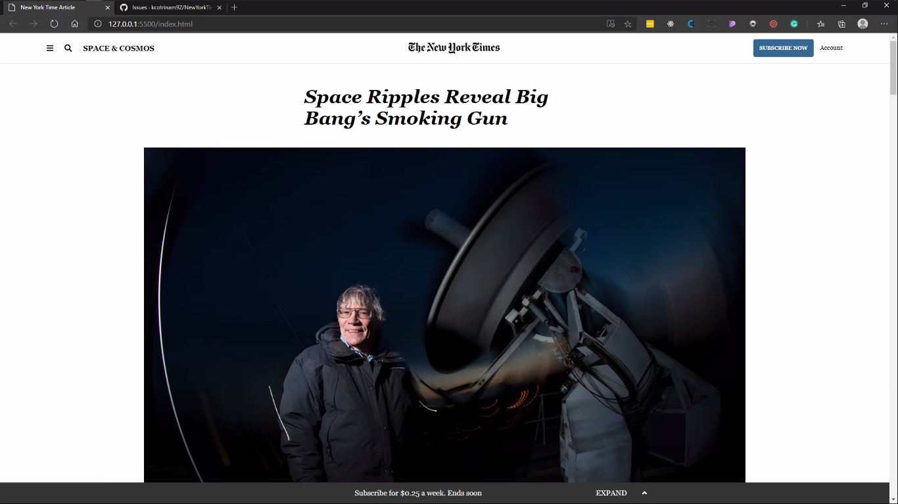

# New York Times article

This project is based on the a New York Times article. It was design in order to practice HTML and css. It has a basic structure, such us a navbar, a section, articles , aside and a footer.

## :hammer: Built with:

- Major languages used for this project were Html5 and css3.
- Font awesome CDN was used to include icons on the buttons.
- Using Float, Flexbox and Grid.
- Vs Code was used as an editor.
- W3C HTML Validator Service
- Microverse linters validators.

## :red_circle: Live Demo:

[Live demo](https://kcotrinam.github.io/NewYorkTimes-article/)

## :construction_worker: Getting Started

To get a local copy up and running follow these simple steps:

- Go to the main page.
- Press the "Code" button and get the repo link.
- Clone it using git command "git clone &lt;link>".

## :bust_in_silhouette: Author1

- Github: [@len23](https://github.com/len23)
- Twitter: [@lenon468](https://twitter.com/lenon468)
- LinkedIn: [Lenin Montalvo](https://www.linkedin.com/in/lenin-montalvo-77660b1b2/)

## :bust_in_silhouette: Author2

- Github: [@kcotrinam](https://github.com/kcotrinam)
- Twitter: [@kevinCot12](https://twitter.com/KevinCot12)
- LinkedIn: [Kevin Contrina](https://www.linkedin.com/in/kevin-cotrina-6208b7149/)

## :raised_hand: :raised_hand: Contributions

Contributions, issues and feature requests are welcome!

Feel free to check the [issues here](https://github.com/kcotrinam92/NewYorkTimes-article/issues).

## Show your support

Give a :star: if you like this project!.

## :grey_exclamation: Acknowlegment

- To [Microverse](https://www.microverse.org/)
- Mentors.
- Stand up team

## :memo: License

This project is [MIT](LICENSE) licensed.
